## Intégration avec un contrôleur de révision (GitLab)

La création des tâches dans Jenkins est vraiment bien , comme nous avons pu le constater il est possible d'écrire n'importe quelle script bash ou autre langage. C'est vraiment simple , cependant si vous utilisez uniquement le texte box dans Jenkins vous allez trouver ça long, pourquoi ? Car bien qu'il y est plein de plugin pour Jenkins il n'y a pas d'option de changer le texte box par un éditeur **VIM** . Oui je sais c'est malheureux :P !!!

Sans blague, voici quelque raison rapidement identifier qui devrez vous décourager vous encourager a utiliser un contrôleur de révision 

* Conservation de l'historique des modifications (Qui , Quand, Quoi )
* Utilisation des scripts en dehors de Jenkins 
* Segmentation de la tâches en plusieurs script , simplifiant la lecture
* Réutilisation de code dans plusieurs tâches
* Plus simple de réaliser des teste en dehors de Jenkins

Nous avons vu l'utilisation de [GitLab lors de la formation](../gitlab/01-presentation.md) sur le sujet, j'utiliserai donc ce système. Le concept est significativement équivalent si vous utilisez **subversion** ou un autre, bien entendu nous avons le concept de branche en plus. 

Comme nous avons déjà fait la présentation de gitlab ( Installation et Configuration de base ), je ne couvrirai pas cette partie vous référez à [la formation](../gitlab/01-presentation.md) . Nous allons tous de suite passé à l'intégration avec Jenkins , au niveau de Docker puis au niveau applicatif. 

### Intégration de gitlab et Jenkins au niveau Docker

Pour réalisé l'intégration simplement modifier le fichier __docker-compose.yml__ , voici le contenu :

```
version: '2'
services:
    jenkins:
        image: jenkins/jenkins
        container_name : 'x3-jenkins-f'
        hostname: jenkins.train.x3rus.com
        environment:
            - TZ=America/Montreal
        volumes:
            - "/srv/docker/x3-jenkins-f/jenkins-data:/var/jenkins_home"
        links:
            - gitlab:gitlabsrv 
    apache-front:
        image: x3-jenkins-front
        build: ./apache-front/.
        container_name : 'x3-jenkins-apache-f'
        hostname : jenkins-front.train.x3rus.com
        environment:
            - TZ=America/Montreal
            - JENKINS_FQDN=jenkins.local.x3rus.com
            - JENKINS_ALIAS=jenkins2.local.x3rus.com
            - ADM_EMAIL=admin@example.com
        links:
            - jenkins:jenkins
    gitlab:
        image: 'gitlab/gitlab-ce:latest'
        container_name : 'x3-gitlab-f'
        hostname: git.training.x3rus.com
        environment:
            TZ: America/Montreal
            GITLAB_OMNIBUS_CONFIG: |
                gitlab_rails['time_zone'] = 'America/Montreal'
                gitlab_rails['gitlab_email_from'] = 'noreply@x3rus.com'
                gitlab_rails['manage_backup_path'] = true
                gitlab_rails['backup_path'] = "/var/opt/gitlab/backups"
                gitlab_rails['backup_archive_permissions'] = 0640 
                gitlab_rails['backup_keep_time'] = 604800
                gitlab_rails['smtp_enable'] = true
        volumes:
            - '/srv/docker/x3-gitlab-f/gitlab/etc:/etc/gitlab'
            - '/srv/docker/x3-gitlab-f/gitlab/logs:/var/log/gitlab'
            - '/srv/docker/x3-gitlab-f/gitlab/data/:/var/opt/gitlab'
```

Voici lien vers le fichier brute : [docker-compose.yml](./docker-compose-gitlab.yml)

Nous avons donc le service gitlab d'ajouter et le liens définie dans le service Jenkins pour qu'il établisse la connexion avec gitlab :

``` 
        links:
            - gitlab:gitlabsrv 
``` 

Démarrage et visualisation de l'exécution :

```bash
$ docker-compose up -d
Recreating x3-gitlab-f2 ... 
Recreating x3-gitlab-f2 ... done
Recreating x3-jenkins-f ... 
Recreating x3-jenkins-f ... done
Recreating x3-jenkins-apache-f ... 
Recreating x3-jenkins-apache-f ... done

$ docker ps                   
CONTAINER ID        IMAGE                     COMMAND                  STATUS                            PORTS                     NAMES  
e42f13fffe37   x3-jenkins-front          "httpd-foreground"       Up 5 seconds                      80/tcp                    x3-jenkins-apache-f                           
0c32b728b551   jenkins/jenkins           "/bin/tini -- /usr..."   Up 7 seconds                      8080/tcp, 50000/tcp       x3-jenkins-f                                  
b99c5fdcfde1   gitlab/gitlab-ce:latest   "/assets/wrapper"        Up 8 seconds (health: starting)   22/tcp, 80/tcp, 443/tcp   x3-gitlab-f  
```

Pour les besoin de la formation je vais réutiliser le conteneur gitlab utilisé lors de la présentation de ce service . Nous avons donc 3 conteneur :

* x3-gitlab-f ( 172.31.0.2 )  : Pour gitlab
* x3-jenkins-f ( 172.31.0.3 ) : Jenkins backend
* x3-jenkins-apache ( 172.31.0.4 ) : Jenkins apache frontend 

### Intégration Gitlab et Jenkins au niveau Applicatif

Nous avons 2 applications qui fonctionnent indépendamment , nous allons mettre en place la connexion entre les 2 services , dans cette section Jenkins réalisera une extraction ( __clone__ ) du projet dans l'espace de travail.

Vous devrez vous assurer que le plugin **git** et **gitlab** sont  bien présent sur votre installation Jenkins.

Prenons le temps de la valider ensemble : 

**Manage Jenkins** --> **plugins** --> **Available**

 

#### Configuration du service Gitlab pour l'échange d'information avec Jenkins

Dans Gitlab, nous avons le projet : **sysadmin/scripts** ( groupe sysadmin , projet scripts ) , créé avec mon utilisateur __thomas__.

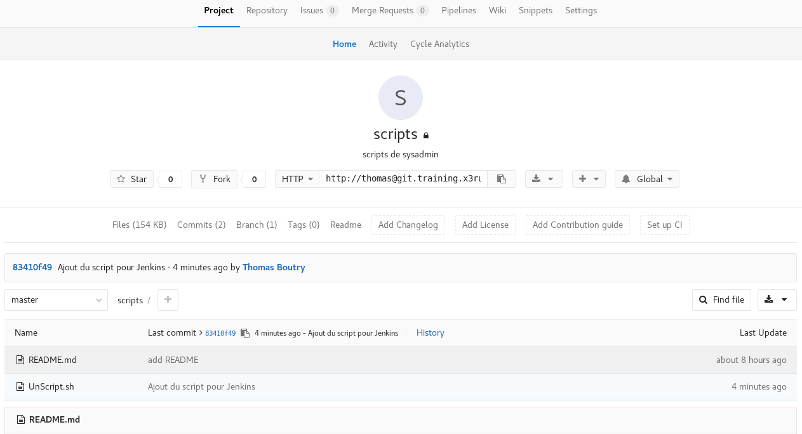

Nous allons créer un utilisateur **robot** qui sera utilisé pour extraire et manipuler les informations, pour cette opération vous aurez besoin d'avoir le compte administrateur (__root__) .


Selon la situation, vous devriez réinitialiser le mot de passe manuellement , revoir le présentation de gitlab ...

J'ai donc l'utilisateur : **robot** avec un mot de passe. 

J'établis une connexion avec l'utilisateur **robot** afin de réaliser une petite configuration , je vais activer l'accès à Gitlab à l'aide d'une clé d'API, ceci m'offrira l'ensemble des possibilités de communications entre Jenkins et Gitlab.

En haut à droite , cliquez sur __setting__ :


Dans le menu choisir **Access token** 

Nous allons assigner un nom convenable pour ce token et comme vous pouvez le voir il est aussi possible de définir une date d'expiration :

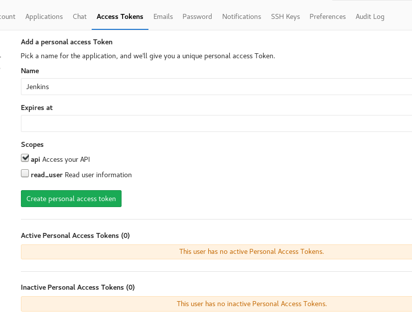

Voici le résultat :


Donc nous avons maintenant le numéro : **sRUqkvz7tvd8uoqs4LzH** , il est important de le conserver en lieu sur :D.

Je vais maintenant retourner avec mon utilisateur **thomas** propriétaire du projet __sysadmin/scripts__ afin de fournir l'accès au projet à l'utilisateur **robot** peut importe la méthode de communication : User / pass ou access Token.

**Projet script** --> **settings** --> **members** 

Nous allons ajouter l'utilisateur **robot** , pour [les permissions voir la documentation](https://docs.gitlab.com/ce/user/permissions.html):


Il est toujours possible de faire un teste passant avec l'utilisateur pour confirmer que l'accès user / pass fonctionne bien :

```bash
$ git clone  http://robot@git.training.x3rus.com/sysadmin/scripts.git 
Cloning into 'scripts'...
Password for 'http://robot@git.training.x3rus.com': 
remote: Counting objects: 6, done.
remote: Compressing objects: 100% (4/4), done.
remote: Total 6 (delta 0), reused 0 (delta 0)
Unpacking objects: 100% (6/6), done.

$ cd scripts/ 
$ ls                          
README.md  UnScript.sh
```

#### Configuration du service Jenkins pour communiquer avec gitlab

Nous avons donc notre utilisateur **robot** configurer dans __gitlab__ avec 2 mode d'accès nom utilisateur / mot de passe et avec un jeton d'accès (__access token__).

Nous allons configurer l'authentification de gitlab dans Jenkins  : **manage Jenkins** --> **global configue** --> **gitlab** 

Pour rappel dans la définition du conteneur Jenkins, nous avons définie que le conteneur gitlab est disponible sous le nom gitlabsrv :

```
        links:                                                                 
            - gitlab:gitlabsrv 
```

Nous allons donc créer une nouvelle job en utilisant cette accès pour la récupération des données. Je vais encore utiliser le mode libre __Free style__:


Nous ajoutons donc une authentification par __Gitlab Token__  , voici le résultat :

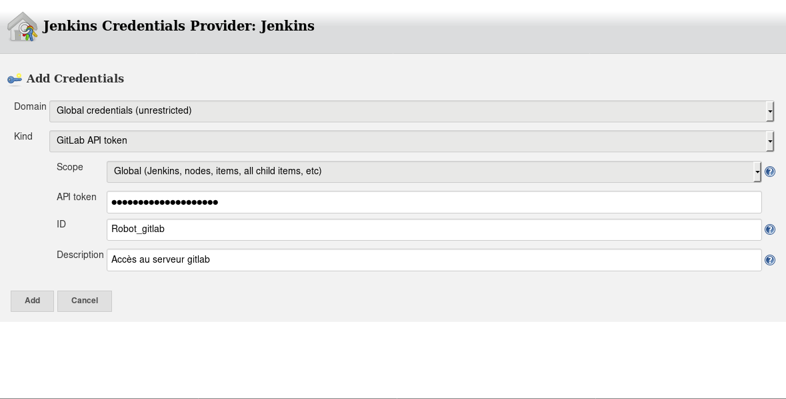

Ceci nous donnera au final ceci avec le petit bouton __Test connexion__ pour valider que tous est ok :

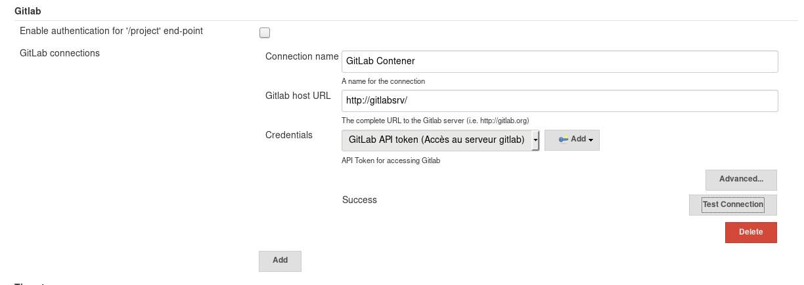

Comme vous pouvez le voir il est possible de définir plusieurs connexion gitlab, donc n'hésitez pas à segmenter vos droit d'accès au système .


#### Création d'une tache

Nous allons ajouter dans les informations d'authentification l'information requis pour la communication ... en cliquant sur **Add**.


Comme vous pouvez le voir directement maintenant j'ai la connexion avec gitlab de présent :

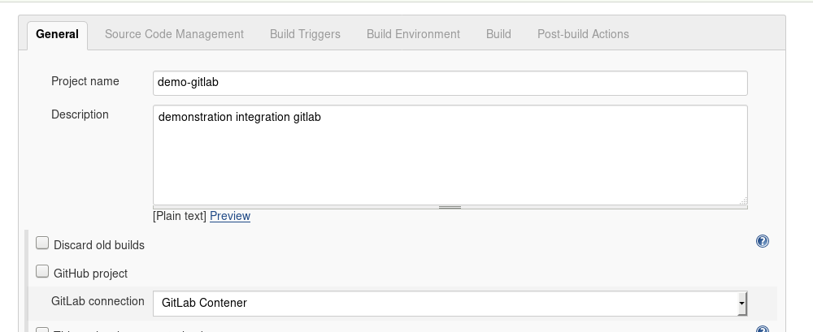

Nous allons maintenant définir où récupérer les fichiers pour la tâches, bien entendu ceci sera dans la section __Source Code Management__ , sélectionnez **git**.

Après avoir saisi l'URL du projet __git__ nous verrons ceci :

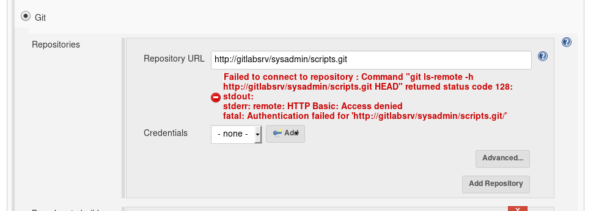

Ceci est plutôt bon signe, car ceci confirme que l'accès n'est pas libre au projet :D. Nous allons donc ajouter les critères d'authentification . Vous allez voir que je n'ai pas utilisé le **jeton** en fait j'ai pas le choix quand j'ai essayé ça ne fonctionne pas ... il semble y avoir une limitation à ce niveau. Voici donc le résultat :

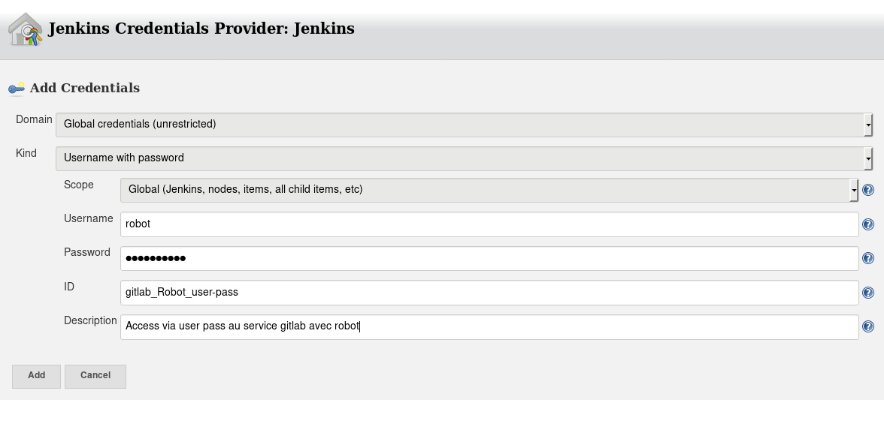 

Nous nous arrêterons là pour le moment, mais j'aimerai vous mettre en lumière la possibilité d'ajouter des fonctionnalités :

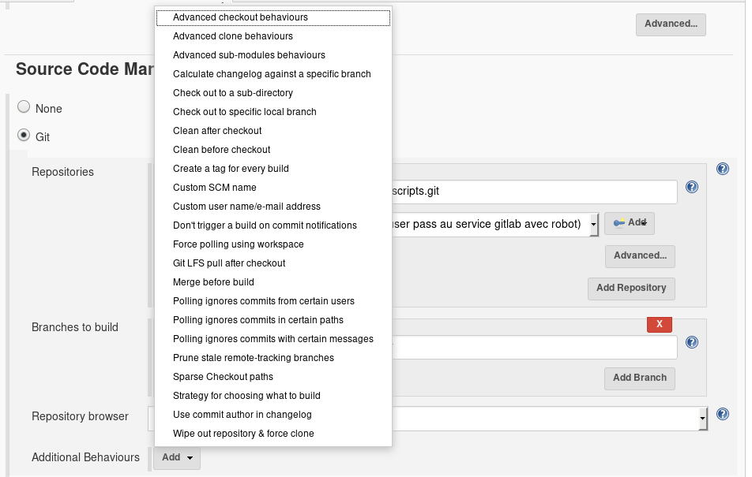

Je vais maintenant ajouter la description du **build** donc la tâche qui sera réalisé :

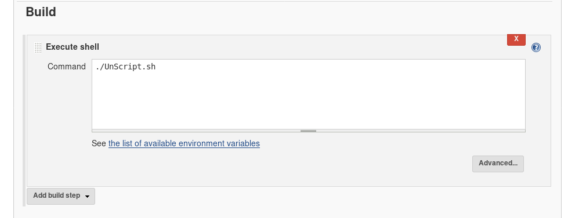

J'ai aussi ajouter les informations pour les paramètres au script ( __FILE\_NAME\_2\_WRITE__ et __B\_MUST\_WRITE__ ) 

Maintenant l'exécution :

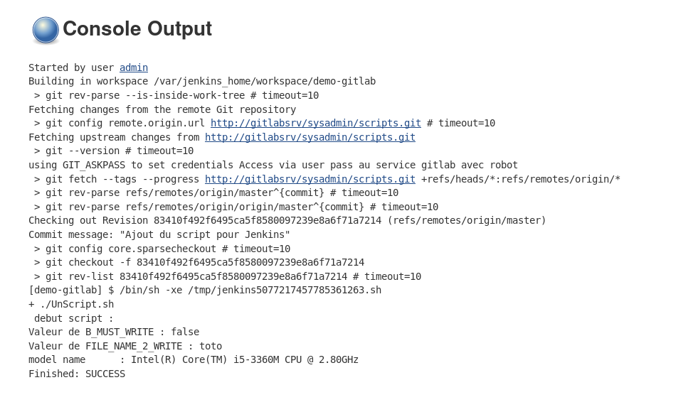

Nous voyons clairement l'extraction du dépôt __git__ et l'exécution du script !!

Nous avons donc l'intégration **simple** de gitlab avec Jenkins pour l'exécution de code depuis un dépôt git !! 
Nous allons continuer avec la configuration de Jenkins et la mise en place de slave , cependant nous reviendrons plus en détail sur la mise en place d'une solution plus complexe pour la réalisation de la compilation du code , création de conteneur et autre ... 

## Configuration d'agent ( slave ) pour Jenkins

Telle que mentionné le **master** Jenkins est une orchestrateur, nous pouvons compiler localement sur la machine cependant ceci n'est pas l'idéal surtout si vous désirez distribuer la charge et avoir plusieurs agent pour réaliser type d'opération.

Nous allons voir comment faire la configuration , bien entendu votre agent doit être idéalement une machine puissante afin de pouvoir réaliser des compilations qui demandent des ressources. Comme Jenkins est un exécuteur, il est aussi possible de se connecter à n'importe quelle machine ce peut être un petit système mais vous désirez réaliser un backup de la BD __sql__ sur demande. Il existe plusieurs plugins disponible pour établir une connexion, dans l'exemple ici nous utiliserons la connexion **SSH** pour l'exercice. Je vais utiliser un conteneur pour que ce soit plus simple pour moi, et aussi pour que vous puissiez reproduire dans votre environnement de laboratoire la configuration.

Donc pour que ceci fonction nous aurons besoin :

1. Un utilisateur configurer sur la machine **slave** avec lequel Jenkins pourra initier la communication via ssh.
2. La mise en place d'une clé ssh pour facilité l'authentification .
3. L'ensemble des applications installé sur le slave pour réaliser les opérations définie dans la tâches.

### Création d'une pair de clé ssh 

Pour les personnes qui ont pas suivie les formations précédente ou pas mis en pratique ou tous simplement oublié puis soyons honnête c'est pénible chercher :P. Un petit rappel pour la génération d'un clé ssh :D. ( Oui vous pouvez dire merci :P ) .

```bash
[~/tmp/jenkins/data] {20990} 
$ ssh-keygen -b 2048 
 Generating public/private rsa key pair.
 Enter file in which to save the key (/home/xerus/.ssh/id_rsa): ./jenkins-nodes_rsa
 Enter passphrase (empty for no passphrase): 
 Enter same passphrase again: 
 Your identification has been saved in ./jenkins-nodes_rsa.
 Your public key has been saved in ./jenkins-nodes_rsa.pub.
 The key fingerprint is:
 SHA256:nShQ8M9u1ANN7GhW8S8taOal/DRqR4sYAkmYcNczbwQ xerus@goishi
 The key s randomart image is:
 +---[RSA 2048]----+
 |...oooE. .o.     |
 | .o..o+ .oo.     |
 |   ....=.+. .    |
 |    o. o*=.o o   |
 |     ..+S O + o  |
 |      .+.= +.o   |
 |       .oo+oo.   |
 |       .. o+o.   |
 |         ....    |
 +----[SHA256]-----+
[~/tmp/formations/jenkins/data] {20991} 
$ ls
jenkins-nodes_rsa  jenkins-nodes_rsa.pub
```

Nous avons donc :

* **jenkins-nodes_rsa** : la clé privé qui ne sortira JAMAIS du serveur Jenkins, comme je n'ai pas mis de passphrase l'ensemble de la sécurité repose sur ce fichier. !!
* **jenkins-nodes_rsa.pub** : la clé publique qui sera distribué sur l'ensemble des agents

Prendre note qu'il est maintenant possible de configurer une passephrase dans Jenkins pour que ce soit utilisable avec la clé, comme j'utilise cette même clé pour des opérations en dehors de Jenkins j'ai tendance a ne pas en mettre. À tord ou à raison , ceci est une gestion de risque en relation avec la sécurité , libre à vous :D.

### Création du conteneur ( Optionnel ) 

Nous allons faire la création du conteneur , pour le moment je ne met que **ssh serveur** ainsi que Java , car l'agent Jenkins est développer en java !!

Voici le résultat du [Dockerfile](./dockers/jenkins-slave/Dockerfile-v1) :

```
 #
 # Description : Jenkins Slave pour formation
 #
 # Author : Thomas.boutry@x3rus.com
 # Licence : GPLv3 ou plus
 #
 # Reference : https://docs.docker.com/engine/examples/running_ssh_service/#build-an-eg_sshd-image
 ###########################################################

FROM ubuntu:16.04
MAINTAINER Thomas Boutry "thomas.boutry@x3rus.com"

 # Installation des applications, besoin de ssh et de java pour le service Jenkins
RUN apt-get update && \
    apt-get install -y openssh-server sudo openjdk-8-jre && \
    mkdir /var/run/sshd

 # SSH login fix. Otherwise user is kicked off after login
RUN sed 's@session\s*required\s*pam_loginuid.so@session optional pam_loginuid.so@g' -i /etc/pam.d/sshd

ENV NOTVISIBLE "in users profile"
RUN echo "export VISIBLE=now" >> /etc/profile


 # Create default user "BOB" with password toto
RUN useradd -s /bin/bash -m  jenkinbot && \
    echo "jenkinbot:toto" | chpasswd && \
    usermod -G sudo jenkinbot

 # Creation du répertoire ssh pour l'utilisateur
RUN mkdir /home/jenkinbot/.ssh/ && \
    chmod 700 /home/jenkinbot/.ssh/

 # Copie la clef publique pour jenkins 
COPY conf/authorized_keys /home/jenkinbot/.ssh/authorized_keys

 # Fix perms
RUN chmod 700 /home/jenkinbot/.ssh/authorized_keys

 # Port et service
EXPOSE 22
CMD ["/usr/sbin/sshd", "-D"]
```

Nous allons ajuster aussi le [docker-compose.yml](./dockers/docker-compose-slave.yml)

```
[ ... OUTPUT COUPÉ ... ]
    jenkins:
        image: jenkins/jenkins
        container_name : 'x3-jenkins-f'
        hostname: jenkins.train.x3rus.com
        environment:
            - TZ=America/Montreal
        volumes:
            - "/srv/docker/x3-jenkins-f/jenkins-data:/var/jenkins_home"
        # ports:
            #- 8080:8080   # Web interface
            #- 50000:50000 # Build Executors
        links:
            - gitlab:gitlabsrv 
            - jenkins-slave:jenkins-s1 
[ ... OUTPUT COUPÉ ... ]
    jenkins-slave: 
        image: x3-jenkins-slave        
        build: ./jenkins-slave/.       
        container_name : 'x3-jenkins-slave-f'                                  
        hostname : jenkins-slave.train.x3rus.com                               
        environment:
            - TZ=America/Montreal  
[ ... OUTPUT COUPÉ ... ]
```

```bash
 $ docker-compose build jenkins-slave
 [ ... OUTPUT COUPÉ ... ]
 Step 12/12 : CMD /usr/sbin/sshd -D     
  ---> Running in 06a94c85a558          
   ---> d9f59db68318                     
   Removing intermediate container 06a94c85a558                                   
   Successfully built d9f59db68318        
   Successfully tagged x3-jenkins-slave:latest  
```

Comme la compilation de l'image est un succès nous passons à l'étape de démarrage de l'ensemble :

```bash
$ docker-compose up -d 

$ docker ps                   
CONTAINER ID        IMAGE                     COMMAND                  STATUS                             PORTS                     NAMES
487a4c53773d        x3-jenkins-front          "httpd-foreground"       Up 35 seconds                      80/tcp                    x3-jenkins-apache-f
de0200c746a1        jenkins/jenkins           "/bin/tini -- /usr..."   Up 36 seconds                      8080/tcp, 50000/tcp       x3-jenkins-f
5695f7c6369c        x3-jenkins-slave          "/usr/sbin/sshd -D"      Up 37 seconds                      22/tcp                    x3-jenkins-slave-f
b99c5fdcfde1        gitlab/gitlab-ce:latest   "/assets/wrapper"        Up 38 seconds (health: starting)   22/tcp, 80/tcp, 443/tcp   x3-gitlab-f

```

### Configuration du slave dans Jenkins

Nous avons notre conteneur ou notre machine physique qui sera utilisé par Jenkins comme agent , avant de définir la configuration dans Jenkins nous allons d'abord valider que la configuration manuellement fonctionne avant d'ajouter la couche Jenkins. 

Pour ce faire nous allons simplement utiliser la clé ssh, préalablement généré, et faire une connexion depuis le **master** jenkins vers le slave avec l'utilisateur définie. 

1. Mise en place de la clé privé sur le serveur Jenkins ( ou le conteneur )
2. Réalisation d'une connexion.


```bash
$ mkdir /srv/docker/x3-jenkins-f/jenkins-data/ssh
$ cp jenkins-nodes_rsa /srv/docker/x3-jenkins-f/jenkins-data/ssh/

$ docker exec -it x3-jenkins-f bash
jenkins@jenkins:/$ ping jenkins-s1
PING jenkins-s1 (172.31.0.3): 56 data bytes
64 bytes from 172.31.0.3: icmp_seq=0 ttl=64 time=0.202 ms

jenkins@jenkins:/$ ssh -i /var/jenkins_home/ssh/jenkins-nodes_rsa jenkinbot@jenkins-s1
The authenticity of host 'jenkins-s1 (172.31.0.3)' can t be established.
ECDSA key fingerprint is SHA256:ef8dN8StPBXRVqlWKjAedKxVN7sMO9y21kVan//cEYk.
Are you sure you want to continue connecting (yes/no)? yes
Warning: Permanently added 'jenkins-s1,172.31.0.3' (ECDSA) to the list of known hosts.
jenkinbot@jenkins-s1's password: 
```

Comme on peut le voir ça ne fonctionne pas :D , si nous avions eu un succès le système n'aurait PAS demandé de mot de passe :D. 
Analyse rapide, j'en profite, car c'est une erreur très commun et quand on a pas l'habitude ça prend du temps à trouver, c'est tellement commun que je le fait encore :P.

* Analyse des permissions des fichiers pour le fichier authorized_keys :

```bash
$ docker exec -it x3-jenkins-slave-f bash

root@jenkins-slave:~# ls -la /home/jenkinbot
total 12
drwxr-xr-x 3 jenkinbot jenkinbot   69 Aug 25 17:45 .
drwxr-xr-x 3 root      root        23 Aug 25 17:45 ..
-rw-r--r-- 1 jenkinbot jenkinbot  220 Aug 31  2015 .bash_logout
-rw-r--r-- 1 jenkinbot jenkinbot 3771 Aug 31  2015 .bashrc
-rw-r--r-- 1 jenkinbot jenkinbot  655 Jun 24  2016 .profile
drwx------ 2 root      root        29 Aug 25 17:45 .ssh

root@jenkins-slave:~# ls -la /home/jenkinbot/.ssh/                             
total 4                                
drwx------ 2 root      root       29 Aug 25 17:45 .                            
drwxr-xr-x 3 jenkinbot jenkinbot  69 Aug 25 17:45 ..                           
-rwx------ 1 root      root      394 Aug 25 17:33 authorized_keys  
```

Le problème ici est le propriétaire du répertoire .ssh et authorized_keys , j'ai donc modifier mon conteneur pour que ce soit jenkinbot (utilisateur) et jenkinbot (le groupe) . Je redémarre les conteneurs et refait le teste :

```bash
$ docker exec -it x3-jenkins-f bash                                    
jenkins@jenkins:/$ cat /proc/cpuinfo ^C                                        
jenkins@jenkins:/$ ping jenkins-s1     
PING jenkins-s1 (172.31.0.3): 56 data bytes                                    
64 bytes from 172.31.0.3: icmp_seq=0 ttl=64 time=0.109 ms 

jenkins@jenkins:/$ ssh -i /var/jenkins_home/ssh/jenkins-nodes_rsa jenkinbot@jenkins-s1                                                                        
Welcome to Ubuntu 16.04.1 LTS (GNU/Linux 4.12.4-1-ARCH x86_64)                 

 * Documentation:  https://help.ubuntu.com                                     
 * Management:     https://landscape.canonical.com                             
 * Support:        https://ubuntu.com/advantage                                

The programs included with the Ubuntu system are free software;                
the exact distribution terms for each program are described in the             
individual files in /usr/share/doc/*/copyright.                                

Ubuntu comes with ABSOLUTELY NO WARRANTY, to the extent permitted by           
applicable law.                        

To run a command as administrator (user "root"), use "sudo <command>".         
See "man sudo_root" for details.       

jenkinbot@jenkins-slave:~$
```

Succès comme le teste passant fonctionne bien nous pouvons passer à l'étape de la configuration dans Jenkins .

Dans l'interface de Jenkins **Manage Jenkins** --> **Manage Nodes** :

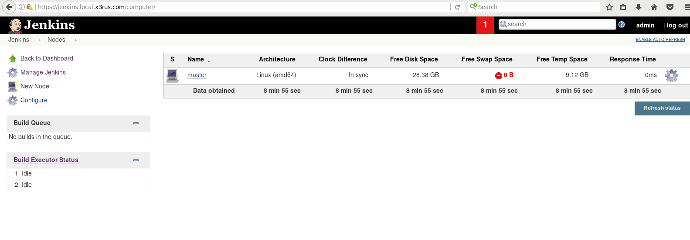

Nous allons donner un nom à notre slave , le nom que je vais choisir est **jenkinbot=slave-c1** :


Je vous suggère de définir le nom de l'utilisateur dans le nom du slave , en plus de la machine , lors que vous voulez voir l'activité vous savez les noms de vos machines donc souvent c'est ce que l'œil voit en premier. Pourquoi le nom de l'utilisateur , car pour des questions de sécurité je vais avoir parfois 2 ou 3 agent de configurer pour la MÊME machine mais avec des noms différents. L'objectif est de segmenter l'accès même si c'est sur la même box.

Nous allons à présent compléter les champs, voici le résultat , presque complet.

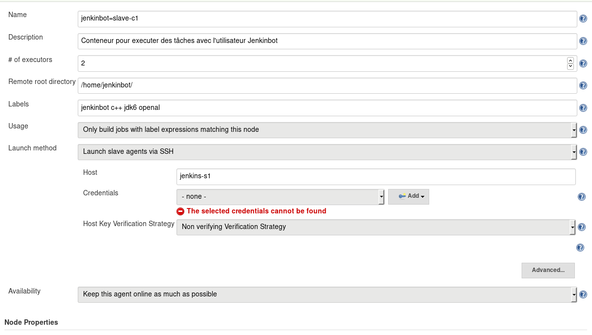

* Description : c'est vraiment pour vous en fait encore plus pour vos collègue :D
* # exécuteurs : Permet de définir le nombre de job qui pourra être exécuter sur la machine , bien entendu il faut faire attention de ne pas tuer la machine en définissant trop d'exécuteurs. Il semble y avoir des plugins pour avoir une gestion dynamique, mais n'ayant aucune expérience je vais vous laissez googlé ça :P.
* Remote root Directory : Permet de définir le répertoire de travaille , idéalement les disques dur devrait être rapide afin de réduire les temps d'accès disque qui ralentisse le traitement des tâches.
* Labels : Les étiquettes seront utilisé afin de définir les caractéristiques de l'agent, nous pourrions définir des applications ou librairies installé afin d'indiquer quelle tâches peux être exécuter sur ce slave.
* Usage : Je privilégie l'utilisation des étiquettes afin d'avoir une meilleur gestion .
* Launch method : Telle que mentionné , pour le moment j'utilise une connexion ssh pour l'établissement de connexion , en plus de la simplicité c'est qu'en plus d'utiliser les slaves avec Jenkins, je vais aussi utiliser les machines de build avec Ansible ou autre pour faire du déploiement . Les machines de build et d'exécution de jobs peuvent avoir plusieurs rôle.
* Host Key Verification Strategy  : J'indique que je ne veux pas de validation , ici libre à vous , cette validation est l'échange de clé ssh qui est réalisé lors de la première connexion . Comme je veux être en mesure de déployer des slaves rapidement je désactive la validation , mais c'est une question de sécurité libre à vous de choisir la bonne option et elle peut être différente selon le slave :D.
* Credential : Information pour la connexion avec ssh , nous utiliserons la clé ssh préalablement créé . 


Voici le résultat  pour les critères d'authentification :

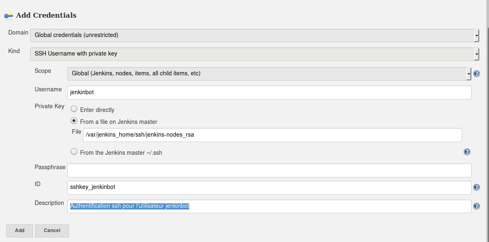 

Comme vous pouvez le voir j'ai opté pour la mise en place du PATH complet pour la clé j'aurai pu aussi copier / coller la clé priver cependant dans l'optique d'avoir une simplification de l'industrialisation de la configuration . J'ai préférer définir un chemin d'accès sur le file système. 

Après avoir sauvegardé et réalisé un refresh de la page :


En cliquant sur le slave et dans le menu de gauche vous avez l'option **System Information** qui vous permet de visualiser l'information du système , ceci est très bien surtout si ce n'est pas vous qui avait configurer les slaves en place de savoir ce que contient le slave :

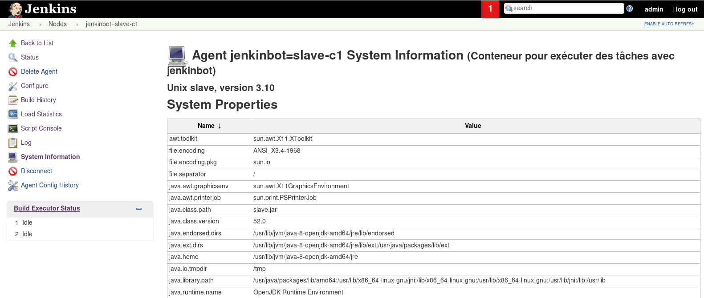

De plus vous pouvez voir le logs de l'agent , particulièrement intéressant quand il y a des problème d'établissement de connexion :P .

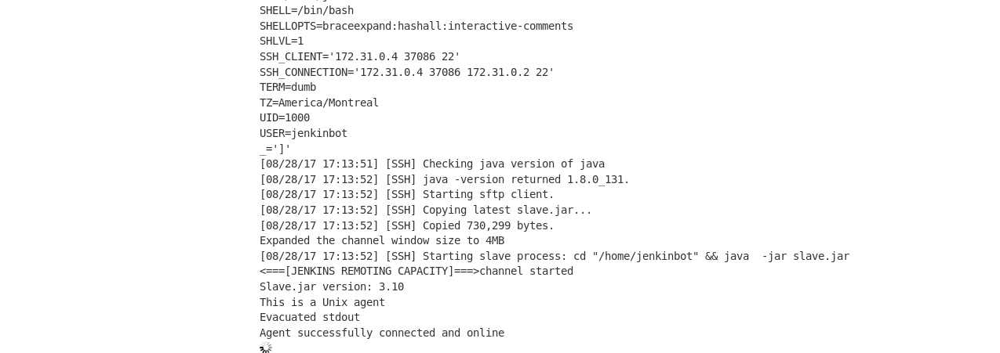

Nous allons faire un ajustement au niveau de l'agent **master** afin que lui aussi utilise les étiquettes ( labels ), afin d'avoir une meilleur gestion du choix de machine. 

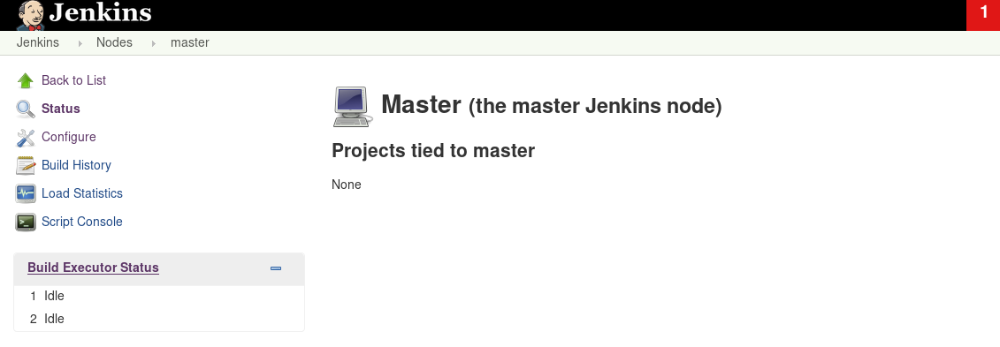

Nous avons donc maintenant des labels différent :


### Démonstration de l'utilisation 

C'est bien beau tous ça mais voyons l'utilisation maintenant de ces exécuteurs , nous allons reprendre la tâche simpliste de récupération des informations du CPU et voir l'assignation au slave à l'aide des étiquettes .

Je reprend la tâche **demo-gitlab** je l'édite pour modifier les labels :


Comme vous pouvez le voir tout de suite Jenkins m'indique que certain slaves correspondes au critère saisie . 
J'exécute la tâches et c'est un succès :

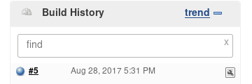

En visualisant le résultat de la console **console output** je peux voir que ceci fut exécuter sur le __master__ :

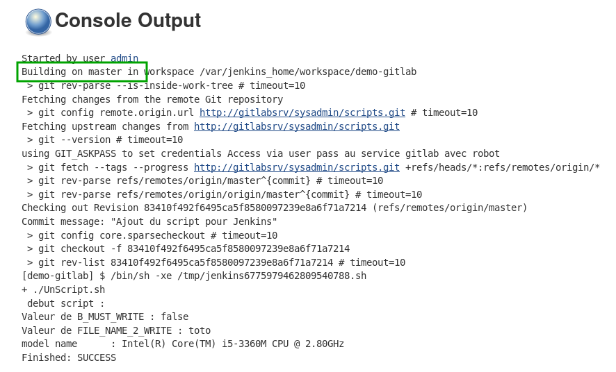


Je désire maintenant forcé que le build soit réalisé sur notre nouveau slave , je vais donc ajouter en plus de __git__ l'étiquette __jenkinbot__ 


Et on lance l'exécution, mais là **BOOOM** :

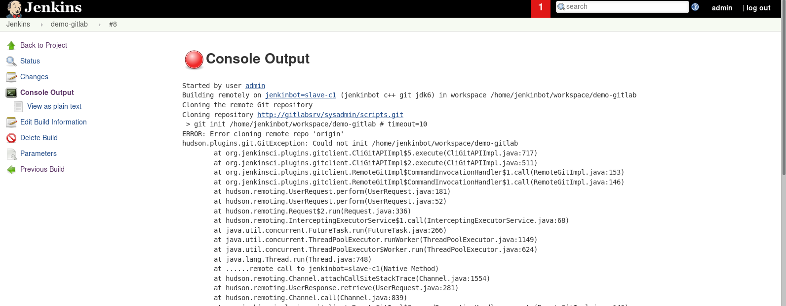 

Mais pourquoi ? Simplement parce que l'application git n'est PAS présente :

```bash
$ docker exec -it x3-jenkins-slave-f bash                                                                                                            
root@jenkins-slave:/# git              
bash: git: command not found   
```

Je voulais faire la démonstration afin de bien sensibilité que Jenkins ne réalise que des exécutions, mais vos slaves doivent être configurer adéquatement pour avoir l'ensemble des requis présents ! L'utilisation des labels doit donc être bien utilisé pour optimisé vos slaves et les licences si Jenkins utilise des applications qui vous oblige à payer des licences.

J'ai installation l'application **git** pour les besoins de la démonstration :

```bash
root@jenkins-slave:/# git --version    
git version 2.7.4

```

Si je le re roule :

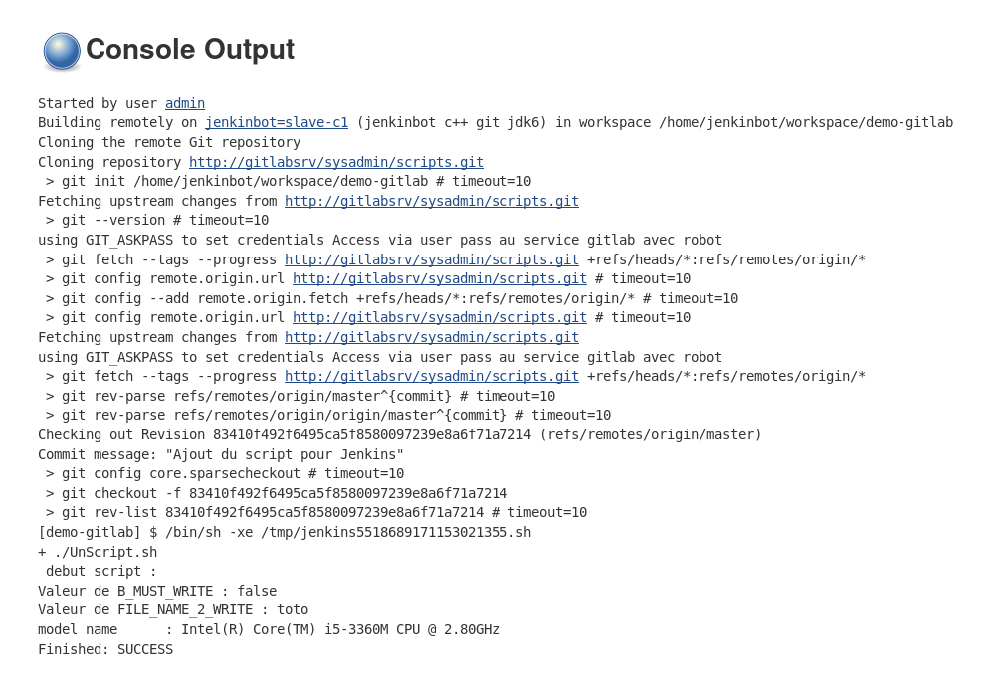

### Recommandation pour vos slaves

Bien de mon point de vue ceci devrait s'appliquer à l'ensemble de vos système, il est particulièrement important d'avoir un système de gestion de configuration de vos slaves. L'idée est d'avoir la certitude qu'ils sont tous pareil avec l'ensemble des outils de configuration requis. 
L'idée est aussi que si vous avez besoin d'augmenter votre puissance de calcul l'ajout d'un slave qu'il soit permanent ou temporaire doit être simple et rapide ! De plus si votre / vos serveurs actuelle ont une problème matériel le remplacement ne devrait pas impacté le développement pendant plusieurs jours . Bien entendu si vous n'avez pas d'autre matériel sous la main il n'y a pas de miracle. 

Pour ce faire nous pouvons utiliser **Puppet** que nous verrons bientôt ...
